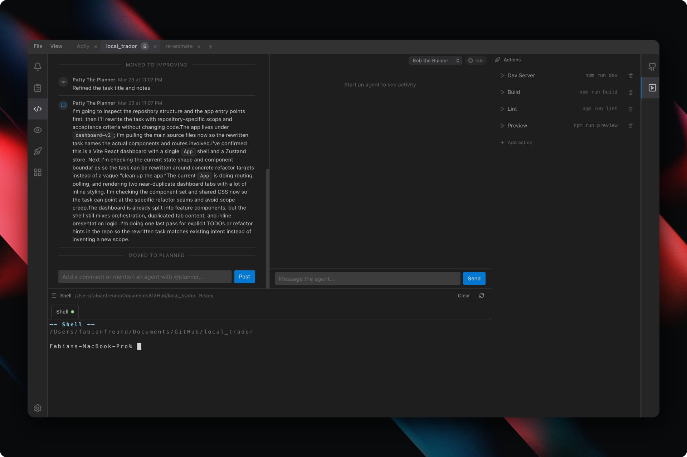

# Actly Editor

> [!NOTE]
> Working desktop builds are coming in the next few days.

**Agentic coding** — build your app in a desktop workspace designed for planning, building, and launching with AI agents.

Actly Editor is a Jira-meets-IDE workspace for shipping apps with coding agents. Instead of bouncing between tickets, chat, terminal tabs, and deployment notes, you get one desktop app where the plan, the builders, the terminal, and the project context all stay in view.

Open a repo, turn ideas into tasks, let AI agents refine and implement them, review approvals inline, run project actions, and keep momentum all the way from rough concept to launch. Patty the Planner rewrites vague work into repo-aware tasks, while Bob the Builder executes inside the same workspace so planning, development, and launch feel like one continuous flow.

Follow progress and build updates on X: [@FabianXR_Builds](https://x.com/FabianXR_Builds)




## What It Does

- Open local repositories as workspaces
- Organize work in a kanban-style task board
- Run Codex agents inside the app through `codex app-server`
- Use role-specific agents like Patty the Planner and Bob the Builder
- Stream agent chat, steps, approvals, and terminal activity live
- Track task activity, comments, references, and attachments
- Review Git changes without leaving the app

## Built-In Agent Flow

- **Patty the Planner** improves tasks before implementation
  Patty moves tasks into `improving`, inspects the codebase, rewrites the title and notes with better context, then moves the task back to `planned`.
- **Bob the Builder** executes implementation work
  Bob moves tasks into `in_progress`, does the work, and completes them into `done`.

You can also trigger agents from task comments with mentions like `@planner` or `@builder`.

## Stack

| Layer | Technology |
|---|---|
| Desktop shell | Tauri v2 |
| Frontend | React 19 + TypeScript + Vite |
| Layout system | flexlayout-react |
| State | Zustand |
| Persistence | SQLite via `@tauri-apps/plugin-sql` |
| Terminal | xterm.js |
| Agent runtime | Codex CLI App Server |
| Native layer | Rust |

## Requirements

| Tool | Version |
|---|---|
| Node.js | 18+ |
| Rust | current stable via `rustup` |
| Codex CLI | available on `PATH` |

Quick check:

```bash
node --version
cargo --version
codex --version
```

## Getting Started

```bash
npm install
npm run tauri:dev
```

Useful commands:

```bash
# Frontend only
npm run dev

# Production web build
npm run build

# Desktop production build
npm run tauri:build
```

## Building for Install

```bash
# Build macOS app and DMG installer (auto-increments build number)
npm run build:macos
```

Output:
- `.app` bundle: `src-tauri/target/release/bundle/macos/Actly Editor.app`
- `.dmg` installer: `src-tauri/target/release/bundle/dmg/Actly Editor_0.1.2_aarch64.dmg`

Install by opening the `.dmg` and dragging the app to Applications.

## Version Management

The app uses semver (`major.minor.patch`) for published artifacts. A build counter is tracked internally in `version.json` and is incremented automatically on each macOS build.

```bash
# Show current version
npm run version:show

# Bump version (resets build to 1)
npm run version:bump -- major   # e.g., 0.1.2 -> 1.0.0
npm run version:bump -- minor   # e.g., 0.1.2 -> 0.2.0
npm run version:bump -- patch   # e.g., 0.1.2 -> 0.1.3
npm run version:bump -- build   # increments internal build counter only

# Increment build counter only (used by build:macos automatically)
npm run version:increment
```

The `build:macos` command automatically increments the build counter before building. `package.json` and `tauri.conf.json` always reflect the semver (`major.minor.patch`).

On first launch, open a project folder. If the project does not have an `.actly/` folder yet, the app can scaffold and initialize it for you.

## How To Use It

1. Open a repository as a workspace.
2. Create a task in the plan board.
3. Assign Patty to improve the task or Bob to implement it.
4. Review chat, task activity, approvals, and terminal output as the run progresses.
5. Use the Git and Actions panels to finish the loop.

## Project Structure

```text
actly-editor/
├── src/
│   ├── components/        # shared UI building blocks
│   ├── layout/            # workspace shell and panel layout
│   ├── panels/            # task board, task detail, agent chat, terminal, git
│   ├── registries/        # built-in panels, agents, actions, models
│   ├── services/          # db access, codex client, tauri wrappers
│   └── store/             # Zustand stores
├── src-tauri/
│   └── src/
│       ├── commands/      # codex + git native commands
│       └── db/            # sqlite migrations
├── docs/                  # architecture and implementation notes
└── CLAUDE.md              # contributor guide for this repo
```

## Documentation

- [CLAUDE.md](CLAUDE.md)
- [Architecture](docs/architecture.md)
- [Panels](docs/panels.md)
- [Agents](docs/agents.md)
- [Codex Integration](docs/codex-integration.md)
- [Documentation Standards](docs/documentation.md)

## Roadmap

- Direct GitHub integration for issues, PR context, and repo workflows
- More built-in agents for planning, implementation, review, and launch flows
- Browser integrations for live app inspection and web automation workflows
- More model providers, including providers like Minimax

## License

This repository now includes a dedicated [LICENSE](LICENSE) file.

In short: personal use, commercial internal use, modification, and internal
deployment are allowed. Resale or commercialization of the software itself is
not allowed without explicit written permission.
